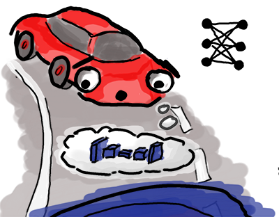

# Self Driving Car Engineer Project 12 - Semantic Segmentation
## Benjamin Söllner, 27 Dec 2017

---



---

In this project, I label the pixels of a road in images using a Fully
Convolutional Network (FCN). The fully convolutional network consists of a pre-
trained encoder based on VGG-16 and a decoder that is trained on a GPU. The
network is implemented using Tensorflow on Python. All code is in ``main.py``.


## Environment
### Frameworks and Packages
Make sure you have the following is installed:
 - [Python 3](https://www.python.org/)
 - [TensorFlow](https://www.tensorflow.org/)
 - [NumPy](http://www.numpy.org/)
 - [SciPy](https://www.scipy.org/)

### Dataset
Download the [Kitti Road dataset](http://www.cvlibs.net/datasets/kitti/eval_road.php) from [here](http://www.cvlibs.net/download.php
  ?file=data_road.zip).  Extract the dataset in the `data` folder.  This will create the folder `data_road` with all the training a test images.

### Run
Run the following command to run the project:
```
python main.py
```
**Note** If running this in Jupyter Notebook system messages, such as those regarding test status, may appear in the terminal rather than the notebook.

### Submitted Files
* [``README.md``](README.md), [``readme.html``](readme.html): you are reading it! :)
* [``main.py``](main.py): logic to implement, train and save the neural network
* [``runs/1514344551.836532/*``](runs/1514344551.836532): images from validation set
